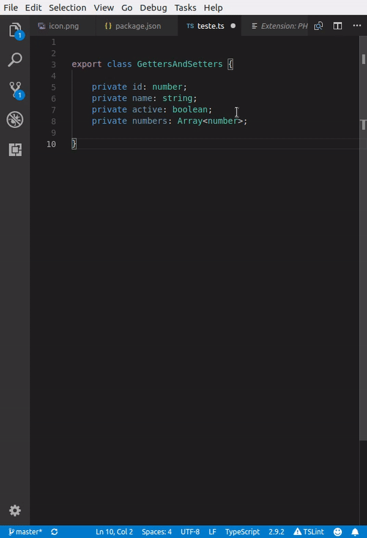
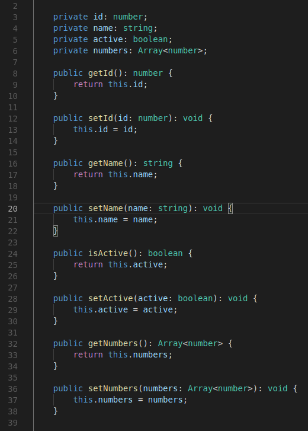
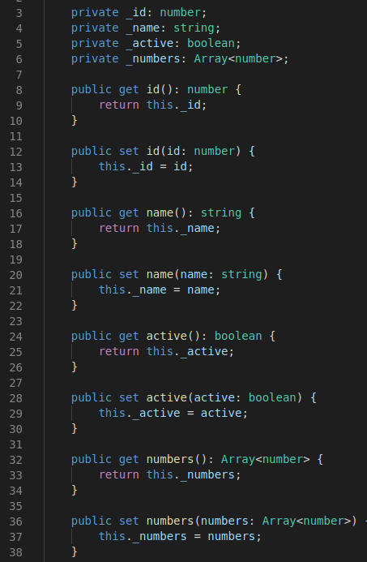

# Generate getters and setters for Visual Studio Code

Generate getters and setters for your Typescript class properties.

Generate getters and setters for your Typescript class properties ES6 pattern.

## Features

This extension allows you to quickly generate getters and setters with one single command.

Features:

Detects indentation error.
Detects valid type hints to use them in the getter and setter.
Generates method's descriptions based on the property description.
Add 1 comand to vscode's command palette:

Insert Generate Getters and Setters.

Insert Generate Getters and Setters ES6 pattern.

## Release Notes

Relevant releases:

### 1.1.6

Generate getters and setters ES6 pattern.

### 1.1.0

Generate getters and setters even without indentation and in all sorts of selection.

### 1.0.1

Fixed camel case problems.

### 1.0.0

Initial version

**Enjoy!**
